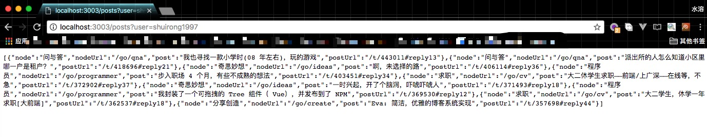

##  v2ex用户创建帖子爬虫

> [v2exUserPosts ](https://github.com/v2exExtensions/v2exUserPosts)扩展的后端程序
>
> 返回特定用户所创建的所有帖子数据


**项目灵感：** [见这个帖子](https://www.v2ex.com/t/448565)

**原理：** 整理用户所有的回帖数据，然后把所有发帖者用户名和当前用户相同的帖子数据存储到数据库里（所有每个用户最终只会执行一次爬取操作）。

但随之而来也有个**缺陷：** 如果用户发帖之后并没有回帖呢?（这个暂时没有更好的思路，如果不是爬取全站用户数据的话…有想法的欢迎交流或者直接参与进来）


### 如何运行？

---

**首先确保：**

* 安装Node环境（网上搜教程，文章）
* 安装MongoDB
* 命令行运行Mongodb： `mongod`

**然后下载运行项目：**

```
git clone https://github.com/v2exExtensions/postsSpider.git
cd postsSpider
npm i // or cnpm i
node ./bin/www
```

PS: 程序监听了3003端口

最后打开浏览器，地址栏输入：http://localhost:3003/posts?user=shuirong1997



